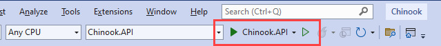
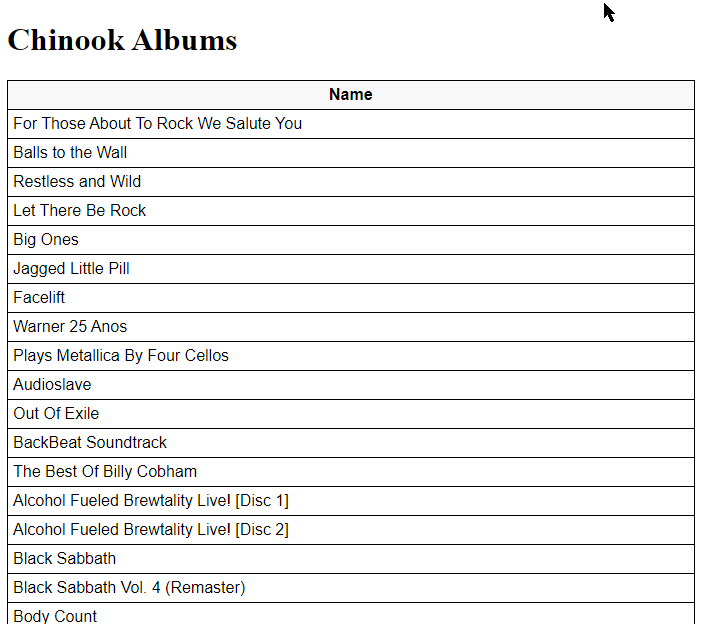

# Consuming ASP.NET Web API in Javascript

## ADD LINES TO CONFIGURE IN STARTUP.CS IN API PROJECT

```csharp
app.UseDefaultFiles();
app.UseStaticFiles();
```

## CREATE A WWWROOT FOLDER IN THE PROJECT ROOT.

## CREATE A CSS FOLDER INSIDE OF THE WWWROOT FOLDER.

## CREATE A JS FOLDER INSIDE OF THE WWWROOT FOLDER.

## ADD AN HTML FILE NAMED INDEX.HTML TO THE WWWROOT FOLDER

```html
<!DOCTYPE html>
<html>
<head>
    <meta charset="UTF-8">
    <title>Chinook Albums</title>
    <link rel="stylesheet" href="css/site.css" />
</head>
<body>
    <h1>Chinook Albums</h1>

<p id="counter"></p>

<table>
    <tr>
        <th>Name</th>
    </tr>
    <tbody id="albums"></tbody>
</table>

<script src="js/site.js" asp-append-version="true"></script>
<script type="text/javascript">
    getAlbums();
</script>
</body>
</html>
```


## ADD A CSS FILE NAMED SITE.CSS TO THE WWWROOT/CSS FOLDER

```css
input[type='submit'], button, [aria-label] {
    cursor: pointer;
}

#editForm {
    display: none;
}

table {
    font-family: Arial, sans-serif;
    border: 1px solid;
    border-collapse: collapse;
}

th {
    background-color: #f8f8f8;
    padding: 5px;
}

td {
    border: 1px solid;
    padding: 5px;
}
```


## ADD A JAVASCRIPT FILE NAMED SITE.JS TO THE WWWROOT/JS FOLDER

```javascript
const uri = 'api/Album';
let albums = [];

function getAlbums() {
    window.fetch(uri)
        .then(response => response.json())
        .then(data => window._displayAlbums(data))
        .catch(error => console.error('Unable to get albums.', error));
}

function _displayCount(albumCount) {
    const name = (window.itemCount === 1) ? 'album' : 'albums';

    document.getElementById('counter').innerText = `${window.itemCount} ${name}`;
}

function _displayAlbums(data) {
    const tBody = document.getElementById('albums');
    tBody.innerHTML = '';

    data.forEach(album => {
        let isCompleteCheckbox = document.createElement('input');

        let tr = tBody.insertRow();

        let td1 = tr.insertCell(0);
        let textNode = document.createTextNode(album.title);
        td1.appendChild(textNode);
    });

    albums = data;
}
```

## UPDATE PROGRAM

Configure the app to serve static files and enable default file mapping. The following highlighted code is needed in Program.cs: 

``` csharp #6-8
// Configure the HTTP request pipeline.
app.UseCors();

app.UseResponseCaching();

app.UseDefaultFiles();
app.UseStaticFiles();

app.UseHttpsRedirection();

app.UseAuthorization();

app.UseSwaggerWithVersioning();

app.MapControllers();

app.Run();

public partial class Program { }
```

## RUN FROM WWWROOT

A change to the ASP.NET Core project's launch settings may be required to test the HTML page locally:

Open Properties\launchSettings.json.


Remove line 6 ""launchUrl": "swagger/","
```json #6
  "profiles": {
    "Chinook.API": {
      "commandName": "Project",
      "dotnetRunMessages": true,
      "launchBrowser": true,
      "launchUrl": "swagger/",
      "applicationUrl": "https://localhost:7211;http://localhost:5211",
      "environmentVariables": {
        "ASPNETCORE_ENVIRONMENT": "Development"
      }
    },
```

Remove the launchUrl property to force the app to open at index.html—the project's default file.

### RUN API PROJECT

Run the Chinook.Api profile



## VIEW RESULTS IN BROWSER


