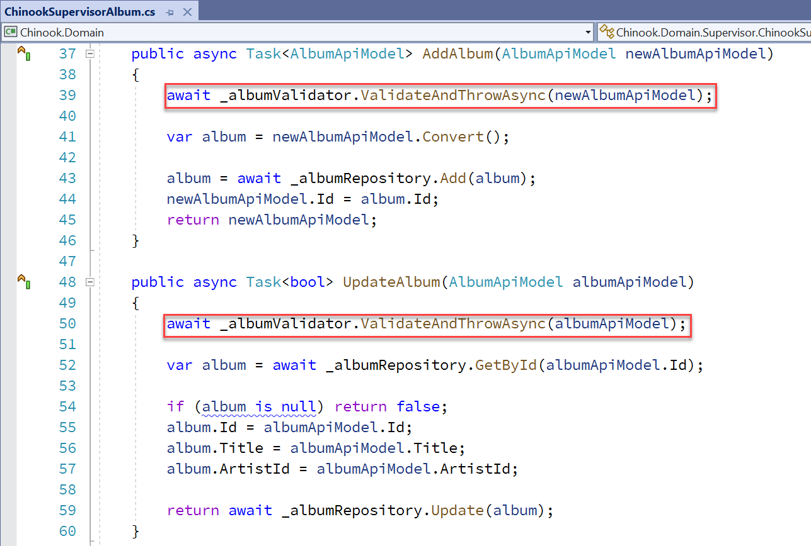

# Developing the Web API Business Rules

## START FROM PREVIOUS MODULE'S END
[Developing the API endpoints](ntier-api-endpoints.md)

## ADD CROSS ORIGIN RESOURCE SHARING (CORS) TO API PROJECT

### ADD ADDCORS() TO SERVICESCONFIGURATION.CS

```csharp
public static void AddCORS(this IServiceCollection services)
{
    services.AddCors(options =>
    {
        options.AddPolicy("CorsPolicy",
            builder => builder.AllowAnyOrigin()
                .AllowAnyMethod()
                .AllowAnyHeader());
    });
}
```

UPDATE STARTUP.CS

```csharp
using Chinook.API.Configurations;

var builder = WebApplication.CreateBuilder(args);

// Add services to the container.
builder.Services.AddConnectionProvider(builder.Configuration);
builder.Services.AddAppSettings(builder.Configuration);
builder.Services.ConfigureRepositories();
builder.Services.ConfigureSupervisor();
builder.Services.ConfigureValidators();
builder.Services.AddAPILogging();
builder.Services.AddCORS();

var app = builder.Build();
app.UseHttpLogging();
app.UseHttpsRedirection();
app.UseCors();
app.MapControllers();

app.Run();
```

## ADD CORS TO CONTROLLERS
```csharp
[Route("api/[controller]")]
[ApiController]
[EnableCors("CorsPolicy")]
public class AlbumController : ControllerBase
{
```

## ADD FLUENTVALIDATION NUGET TO API AND DOMAIN PROJECTS

```dos
dotnet add package FluentValidation
dotnet add package FluentValidation.AspNetCore
```

## ADD VALIDATORS TO DOMAIN PROJECT


```csharp
using Chinook.Domain.ApiModels;
using FluentValidation;

namespace Chinook.Domain.Validation;

public class AlbumValidator : AbstractValidator<AlbumApiModel>
{
    public AlbumValidator()
    {
        RuleFor(a => a.Title).NotNull();
        RuleFor(a => a.Title).MinimumLength(3);
        RuleFor(a => a.Title).MaximumLength(160);
        RuleFor(a => a.ArtistId).NotNull();
    }
}
```

## ADD VALIDATORS TO DEPENDENCY INJECTION IN STARTUP IN API PROJECT

```csharp
public static void ConfigureValidators(this IServiceCollection services)
{
    services.AddFluentValidation()
        .AddTransient<IValidator<AlbumApiModel>, AlbumValidator>()
        .AddTransient<IValidator<ArtistApiModel>, ArtistValidator>()
        .AddTransient<IValidator<CustomerApiModel>, CustomerValidator>()
        .AddTransient<IValidator<EmployeeApiModel>, EmployeeValidator>()
        .AddTransient<IValidator<GenreApiModel>, GenreValidator>()
        .AddTransient<IValidator<InvoiceApiModel>, InvoiceValidator>()
        .AddTransient<IValidator<InvoiceLineApiModel>, InvoiceLineValidator>()
        .AddTransient<IValidator<MediaTypeApiModel>, MediaTypeValidator>()
        .AddTransient<IValidator<PlaylistApiModel>, PlaylistValidator>()
        .AddTransient<IValidator<TrackApiModel>, TrackValidator>();
}
```

### ADD CONFIGUREVALIDATORS TO CONFIGURESERVICES

```csharp
builder.Services.ConfigureValidators();
```

## GET VALIDATORS FROM DI IN SUPERVISOR

```csharp
public partial class ChinookSupervisor : IChinookSupervisor
{
    private readonly IAlbumRepository _albumRepository;
    private readonly IArtistRepository _artistRepository;
    private readonly ICustomerRepository _customerRepository;
    private readonly IEmployeeRepository _employeeRepository;
    private readonly IGenreRepository _genreRepository;
    private readonly IInvoiceLineRepository _invoiceLineRepository;
    private readonly IInvoiceRepository _invoiceRepository;
    private readonly IMediaTypeRepository _mediaTypeRepository;
    private readonly IPlaylistRepository _playlistRepository;
    private readonly ITrackRepository _trackRepository;

    private readonly IValidator<AlbumApiModel> _albumValidator;
    private readonly IValidator<ArtistApiModel> _artistValidator;
    private readonly IValidator<CustomerApiModel> _customerValidator;
    private readonly IValidator<EmployeeApiModel> _employeeValidator;
    private readonly IValidator<GenreApiModel> _genreValidator;
    private readonly IValidator<InvoiceApiModel> _invoiceValidator;
    private readonly IValidator<InvoiceLineApiModel> _invoiceLineValidator;
    private readonly IValidator<MediaTypeApiModel> _mediaTypeValidator;
    private readonly IValidator<PlaylistApiModel> _playlistValidator;
    private readonly IValidator<TrackApiModel> _trackValidator;

    public ChinookSupervisor(IAlbumRepository albumRepository,
        IArtistRepository artistRepository,
        ICustomerRepository customerRepository,
        IEmployeeRepository employeeRepository,
        IGenreRepository genreRepository,
        IInvoiceLineRepository invoiceLineRepository,
        IInvoiceRepository invoiceRepository,
        IMediaTypeRepository mediaTypeRepository,
        IPlaylistRepository playlistRepository,
        ITrackRepository trackRepository,
        IValidator<AlbumApiModel> albumValidator,
        IValidator<ArtistApiModel> artistValidator,
        IValidator<CustomerApiModel> customerValidator,
        IValidator<EmployeeApiModel> employeeValidator,
        IValidator<GenreApiModel> genreValidator,
        IValidator<InvoiceApiModel> invoiceValidator,
        IValidator<InvoiceLineApiModel> invoiceLineValidator,
        IValidator<MediaTypeApiModel> mediaTypeValidator,
        IValidator<PlaylistApiModel> playlistValidator,
        IValidator<TrackApiModel> trackValidator
    )
    {
        _albumRepository = albumRepository;
        _artistRepository = artistRepository;
        _customerRepository = customerRepository;
        _employeeRepository = employeeRepository;
        _genreRepository = genreRepository;
        _invoiceLineRepository = invoiceLineRepository;
        _invoiceRepository = invoiceRepository;
        _mediaTypeRepository = mediaTypeRepository;
        _playlistRepository = playlistRepository;
        _trackRepository = trackRepository;

        _albumValidator = albumValidator;
        _artistValidator = artistValidator;
        _customerValidator = customerValidator;
        _employeeValidator = employeeValidator;
        _genreValidator = genreValidator;
        _invoiceValidator = invoiceValidator;
        _invoiceLineValidator = invoiceLineValidator;
        _mediaTypeValidator = mediaTypeValidator;
        _playlistValidator = playlistValidator;
        _trackValidator = trackValidator;
    }
```

## ADD CODE TO CALL VALIDATION IN SUPERVISOR



```csharp
public async Task<AlbumApiModel> AddAlbum(AlbumApiModel newAlbumApiModel)
{
    await _albumValidator.ValidateAndThrowAsync(newAlbumApiModel);

    var album = newAlbumApiModel.Convert();

    album = await _albumRepository.Add(album);
    newAlbumApiModel.Id = album.Id;
    return newAlbumApiModel;
}

public async Task<bool> UpdateAlbum(AlbumApiModel albumApiModel)
{
    await _albumValidator.ValidateAndThrowAsync(albumApiModel);

    var album = await _albumRepository.GetById(albumApiModel.Id);

    if (album is null) return false;
    album.Id = albumApiModel.Id;
    album.Title = albumApiModel.Title;
    album.ArtistId = albumApiModel.ArtistId;

    return await _albumRepository.Update(album);
}
```

## ADD ERROR HANDLING IN ACTIONS

```csharp
[Route("api/[controller]")]
[ApiController]
[EnableCors("CorsPolicy")]
public class AlbumController : ControllerBase
{
    private readonly IChinookSupervisor _chinookSupervisor;
    private readonly ILogger<AlbumController> _logger;

    public AlbumController(IChinookSupervisor chinookSupervisor, ILogger<AlbumController> logger)
    {
        _chinookSupervisor = chinookSupervisor;
        _logger = logger;
    }

    [HttpGet]
    [Produces(typeof(List<AlbumApiModel>))]
    public async Task<ActionResult<List<AlbumApiModel>>> Get()
    {
        try  
        {  
            var albums = await _chinookSupervisor.GetAllAlbum();  

            if (albums.Any())  
            {  
                return Ok(albums);  
            }  
            else  
            {  
                return StatusCode((int)HttpStatusCode.NotFound, "No Albums Could Be Found");  
            }  
        }  
        catch (Exception ex)  
        {  
            _logger.LogError($"Something went wrong inside the AlbumController Get action: {ex}");  
            return StatusCode((int)HttpStatusCode.InternalServerError, "Error occurred while executing Get All Albums");  
        }  
    }

    [HttpGet("{id}", Name = "GetAlbumById")]
    public async Task<ActionResult<AlbumApiModel>> Get(int id)
    {
        try  
        {  
            var album = await _chinookSupervisor.GetAlbumById(id);  

            if (album != null)  
            {  
                return Ok(album);  
            }  
            else  
            {  
                return StatusCode((int)HttpStatusCode.NotFound, "Album Not Found");  
            }  
        }  
        catch (Exception ex)  
        {  
            _logger.LogError($"Something went wrong inside the AlbumController GetById action: {ex}");  
            return StatusCode((int)HttpStatusCode.InternalServerError, "Error occurred while executing Get Album By Id");  
        }
    }

    [HttpPost]
    [Produces("application/json")]
    [Consumes("application/json")]
    public async Task<ActionResult<AlbumApiModel>> Post([FromBody] AlbumApiModel input)
    {
        try
        {
            if (input == null)
            {
                return StatusCode((int)HttpStatusCode.BadRequest, "Given Album is null");
            }
            else
            {
                return Ok(await _chinookSupervisor.AddAlbum(input));
            }
        }
        catch (ValidationException  ex)  
        {  
            _logger.LogError($"The Album could not validated: Add Album action: {ex}");  
            return StatusCode((int)HttpStatusCode.InternalServerError, "Validation error while executing Add Albums");  
        }
        catch (Exception ex)  
        {  
            _logger.LogError($"Something went wrong inside the AlbumController Add Album action: {ex}");  
            return StatusCode((int)HttpStatusCode.InternalServerError, "Error occurred while executing Add Albums");  
        }
    }

    [HttpPut("{id}")]
    [Produces("application/json")]
    [Consumes("application/json")]
    public async Task<ActionResult<AlbumApiModel>> Put(int id, [FromBody] AlbumApiModel input)
    {
        try  
        {  
            if (input == null)  
            {  
                return StatusCode((int)HttpStatusCode.BadRequest, "Given Album is null");
            }  
            else  
            {
                return Ok(await _chinookSupervisor.UpdateAlbum(input));
            }  
        }
        catch (ValidationException  ex)  
        {  
            _logger.LogError($"The Album could not validated: Update Album action: {ex}");  
            return StatusCode((int)HttpStatusCode.InternalServerError, "Validation error while executing Update Albums");  
        }
        catch (Exception ex)  
        {  
            _logger.LogError($"Something went wrong inside the AlbumController Update Album action: {ex}");  
            return StatusCode((int)HttpStatusCode.InternalServerError, "Error occurred while executing Update Albums");  
        }
    }

    [HttpDelete("{id}")]
    public async Task<ActionResult> Delete(int id)
    {
        try  
        {  
            return Ok(await _chinookSupervisor.DeleteAlbum(id)); 
        }  
        catch (Exception ex)  
        {  
            _logger.LogError($"Something went wrong inside the AlbumController Delete action: {ex}");  
            return StatusCode((int)HttpStatusCode.InternalServerError, "Error occurred while executing Delete Album");  
        }
    }

    [HttpGet("artist/{id}")]
    public async Task<ActionResult<List<AlbumApiModel>>> GetByArtistId(int id)
    {
        try  
        {  
            var albums = await _chinookSupervisor.GetAlbumByArtistId(id);  

            if (albums.Any())  
            {  
                return Ok(albums);  
            }  
            else  
            {  
                return StatusCode((int)HttpStatusCode.NotFound, "No Albums Could Be Found for the Artist");  
            }  
        }  
        catch (Exception ex)  
        {  
            _logger.LogError($"Something went wrong inside the AlbumController Get By Artist action: {ex}");  
            return StatusCode((int)HttpStatusCode.InternalServerError, "Error occurred while executing Get All Albums for Artist");  
        }  
    }
}
```

## ERROR HANDLING AND RETURNING PROBLEM DETAILS

For more details look at the <a href="https://github.com/cwoodruff/Chinook6WebAPI" target="_blank">Chinook6WebAPI repo in GitHub</a>.