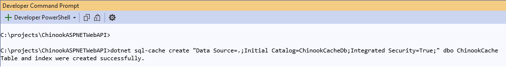

# Caching Data in Your API

## START FROM PREVIOUS MODULE'S END
[Developing the Web API Business Rules](api-business-rules.md)

## RESPONSE CACHING

### ADD RESPONSE CACHING TO ADDCACHING() IN SERVICESCONFIGURATION.CS

```csharp
public static void AddCaching(this IServiceCollection services,
    IConfiguration configuration)
{
    services.AddResponseCaching();
}
```

### ADD TO CONFIGURE() IN STARTUP.CS
**** Note: needs to go after CORS**

```csharp
using Chinook.API.Configurations;

var builder = WebApplication.CreateBuilder(args);

builder.Services.AddAppSettings(builder.Configuration);
builder.Services.AddConnectionProvider(builder.Configuration);
builder.Services.ConfigureRepositories();
builder.Services.ConfigureSupervisor();
builder.Services.AddAPILogging();
builder.Services.AddCORS();
builder.Services.ConfigureValidators();
builder.Services.AddCaching(builder.Configuration);
builder.Services.AddControllers();

var app = builder.Build();

// Configure the HTTP request pipeline.
app.UseCors();

app.UseResponseCaching();

app.UseHttpsRedirection();

app.UseAuthorization();

app.MapControllers();

app.Run();
```

### ADD TO CONTROLLERS OR ACTIONS

```csharp
[Route("api/[controller]")]
[ApiController]
[EnableCors("CorsPolicy")]
[ResponseCache(Duration = 604800)]
public class GenreController : ControllerBase
```

**Note: 604800 is seconds and equals a week**

#### What is seen in the Response Header
Response Header:
Cache-Control: public,max-age=604800

Test in Postman and web browser to see how the API Consumer behaves.

## IN-MEMORY CACHING

### Install Microsoft.Extensions.Caching.Abstractions NuGet package to Domain

```dos
dotnet add package Microsoft.Extensions.Caching.Abstractions
```

### ADD IN-MEMORY CACHING TO ADDCACHING() IN SERVICESCONFIGURATION.CS

```csharp
public static void AddCaching(this IServiceCollection services,
    IConfiguration configuration)
{
    services.AddResponseCaching();
    services.AddMemoryCache();
}
```

### ADD MEMORYCACHE TO SUPERVISOR AND GET FROM DI

#### ChinookSupervisor.cs
```csharp
public partial class ChinookSupervisor : IChinookSupervisor
{
    private readonly IAlbumRepository _albumRepository;
    private readonly IArtistRepository _artistRepository;
    private readonly ICustomerRepository _customerRepository;
    private readonly IEmployeeRepository _employeeRepository;
    private readonly IGenreRepository _genreRepository;
    private readonly IInvoiceLineRepository _invoiceLineRepository;
    private readonly IInvoiceRepository _invoiceRepository;
    private readonly IMediaTypeRepository _mediaTypeRepository;
    private readonly IPlaylistRepository _playlistRepository;
    private readonly ITrackRepository _trackRepository;

    private readonly IValidator<AlbumApiModel> _albumValidator;
    private readonly IValidator<ArtistApiModel> _artistValidator;
    private readonly IValidator<CustomerApiModel> _customerValidator;
    private readonly IValidator<EmployeeApiModel> _employeeValidator;
    private readonly IValidator<GenreApiModel> _genreValidator;
    private readonly IValidator<InvoiceApiModel> _invoiceValidator;
    private readonly IValidator<InvoiceLineApiModel> _invoiceLineValidator;
    private readonly IValidator<MediaTypeApiModel> _mediaTypeValidator;
    private readonly IValidator<PlaylistApiModel> _playlistValidator;
    private readonly IValidator<TrackApiModel> _trackValidator;

    private readonly IMemoryCache _cache;

    public ChinookSupervisor(IAlbumRepository albumRepository,
        IArtistRepository artistRepository,
        ICustomerRepository customerRepository,
        IEmployeeRepository employeeRepository,
        IGenreRepository genreRepository,
        IInvoiceLineRepository invoiceLineRepository,
        IInvoiceRepository invoiceRepository,
        IMediaTypeRepository mediaTypeRepository,
        IPlaylistRepository playlistRepository,
        ITrackRepository trackRepository,
        IValidator<AlbumApiModel> albumValidator,
        IValidator<ArtistApiModel> artistValidator,
        IValidator<CustomerApiModel> customerValidator,
        IValidator<EmployeeApiModel> employeeValidator,
        IValidator<GenreApiModel> genreValidator,
        IValidator<InvoiceApiModel> invoiceValidator,
        IValidator<InvoiceLineApiModel> invoiceLineValidator,
        IValidator<MediaTypeApiModel> mediaTypeValidator,
        IValidator<PlaylistApiModel> playlistValidator,
        IValidator<TrackApiModel> trackValidator,
        IMemoryCache memoryCache
    )
    {
        _albumRepository = albumRepository;
        _artistRepository = artistRepository;
        _customerRepository = customerRepository;
        _employeeRepository = employeeRepository;
        _genreRepository = genreRepository;
        _invoiceLineRepository = invoiceLineRepository;
        _invoiceRepository = invoiceRepository;
        _mediaTypeRepository = mediaTypeRepository;
        _playlistRepository = playlistRepository;
        _trackRepository = trackRepository;

        _albumValidator = albumValidator;
        _artistValidator = artistValidator;
        _customerValidator = customerValidator;
        _employeeValidator = employeeValidator;
        _genreValidator = genreValidator;
        _invoiceValidator = invoiceValidator;
        _invoiceLineValidator = invoiceLineValidator;
        _mediaTypeValidator = mediaTypeValidator;
        _playlistValidator = playlistValidator;
        _trackValidator = trackValidator;

        _cache = memoryCache;
    }
}
```

### ADD CODE TO SUPERVISOR FOR EACH ENTITY TYPE NEEDED

#### ChinookSupervisorAlbum.cs

```csharp
public async Task<IEnumerable<AlbumApiModel>> GetAllAlbum()
{
    List<Album> albums = await _albumRepository.GetAll();
    var albumApiModels = albums.ConvertAll();

    foreach (var album in albumApiModels)
    {
        var cacheEntryOptions =
            new MemoryCacheEntryOptions().SetSlidingExpiration(TimeSpan.FromSeconds(604800))
                .AbsoluteExpirationRelativeToNow = TimeSpan.FromSeconds(604800);
        ;
        _cache.Set(string.Concat("Album-", album.Id), album, (TimeSpan)cacheEntryOptions);
    }

    return albumApiModels;
}

public async Task<AlbumApiModel?> GetAlbumById(int id)
{
    var albumApiModelCached = _cache.Get<AlbumApiModel>(string.Concat("Album-", id));

    if (albumApiModelCached != null)
    {
        return albumApiModelCached;
    }
    else
    {
        var album = await _albumRepository.GetById(id);
        if (album == null) return null;
        var albumApiModel = album.Convert();
        var result = (_artistRepository.GetById(album.ArtistId)).Result;
        if (result != null)
            albumApiModel.ArtistName = result.Name;
        albumApiModel.Tracks = (await GetTrackByAlbumId(id) ?? Array.Empty<TrackApiModel>()).ToList();

        var cacheEntryOptions =
            new MemoryCacheEntryOptions().SetSlidingExpiration(TimeSpan.FromSeconds(604800))
                .AbsoluteExpirationRelativeToNow = TimeSpan.FromSeconds(604800);
        ;
        _cache.Set(string.Concat("Album-", albumApiModel.Id), albumApiModel, (TimeSpan)cacheEntryOptions);

        return albumApiModel;
    }
}
```

## DISTRIBUTED CACHING

### Install tool for MSSQL distrubuted caching using the commend in Command Prompt

```dos
dotnet tool install --global dotnet-sql-cache
```


### CREATE NEW EMPTY DATABASE ChinookCacheDb IN MSSQL

```sql
USE master;
GO
CREATE DATABASE ChinookCacheDb;
GO
-- Verify the database files and sizes
SELECT name, size, size*1.0/128 AS [Size in MBs]
FROM sys.master_files
WHERE name = N'ChinookCacheDb';
GO
```

### Run from Command Prompt

```dos
dotnet sql-cache create "Data Source=.;Initial Catalog=ChinookCacheDb;Integrated Security=True;" dbo ChinookCache
```



### INSTALLING THE MSSQL DOCKER CONTAINER WITH DIST CACHING DATABASE

Please install this updated docker image with the database for the distributed caching demo.

*** Instructions can be found here [Installing and Setting Up SQL Server 2022 in Docker](../installing-mssql-docker.md)

``` dos
docker pull woodruffsolutions/sql-2022-chinook-dist-caching
```

### Install Microsoft.Extensions.Caching.SqlServer NuGet package to Domain

```dos
dotnet add package Microsoft.Extensions.Caching.SqlServer
```

### ADD ChinookSQLCache CONNECTIONSTRING TO APPSETTINGS
```json
{
  "Logging": {
    "LogLevel": {
      "Default": "Information",
      "Microsoft.AspNetCore": "Warning",
      "Microsoft.AspNetCore.HttpLogging.HttpLoggingMiddleware": "Information"
    }
  },
  "AllowedHosts": "*",
  "ConnectionStrings": {
    "ChinookDbWindows": "Server=.;Database=Chinook;Trusted_Connection=True;TrustServerCertificate=True;Application Name=Chinook7WebAPI",
    "ChinookDbDocker": "Server=localhost,1433;Database=Chinook;User=sa;Password=P@55w0rd;Trusted_Connection=False;Application Name=ChinookASPNETCoreAPINTier",
    "ChinookSQLCache": "Data Source=.;Initial Catalog=ChinookCacheDb;Integrated Security=True;TrustServerCertificate=True"
  }
}
```

### ADD DISTRIBUTED CACHING TO ADDCACHING() IN SERVICESCONFIGURATION.CS

```csharp
public static void AddCaching(this IServiceCollection services,
    IConfiguration configuration)
{
    services.AddResponseCaching();
    services.AddMemoryCache();
    services.AddDistributedSqlServerCache(options =>
    {
        options.ConnectionString = configuration.GetConnectionString("ChinookSQLCache");
        options.SchemaName = "dbo";
        options.TableName = "ChinookCache";
    });
}
```

### ADD DISTRIBUTEDCACHE TO SUPERVISOR AND GET FROM DI

#### ChinookSupervisor.cs
```csharp
public partial class ChinookSupervisor : IChinookSupervisor
{
    private readonly IAlbumRepository _albumRepository;
    private readonly IArtistRepository _artistRepository;
    private readonly ICustomerRepository _customerRepository;
    private readonly IEmployeeRepository _employeeRepository;
    private readonly IGenreRepository _genreRepository;
    private readonly IInvoiceLineRepository _invoiceLineRepository;
    private readonly IInvoiceRepository _invoiceRepository;
    private readonly IMediaTypeRepository _mediaTypeRepository;
    private readonly IPlaylistRepository _playlistRepository;
    private readonly ITrackRepository _trackRepository;

    private readonly IValidator<AlbumApiModel> _albumValidator;
    private readonly IValidator<ArtistApiModel> _artistValidator;
    private readonly IValidator<CustomerApiModel> _customerValidator;
    private readonly IValidator<EmployeeApiModel> _employeeValidator;
    private readonly IValidator<GenreApiModel> _genreValidator;
    private readonly IValidator<InvoiceApiModel> _invoiceValidator;
    private readonly IValidator<InvoiceLineApiModel> _invoiceLineValidator;
    private readonly IValidator<MediaTypeApiModel> _mediaTypeValidator;
    private readonly IValidator<PlaylistApiModel> _playlistValidator;
    private readonly IValidator<TrackApiModel> _trackValidator;

    private readonly IMemoryCache _cache;

    private readonly IDistributedCache _distributedCache;

    public ChinookSupervisor(IAlbumRepository albumRepository,
        IArtistRepository artistRepository,
        ICustomerRepository customerRepository,
        IEmployeeRepository employeeRepository,
        IGenreRepository genreRepository,
        IInvoiceLineRepository invoiceLineRepository,
        IInvoiceRepository invoiceRepository,
        IMediaTypeRepository mediaTypeRepository,
        IPlaylistRepository playlistRepository,
        ITrackRepository trackRepository,
        IValidator<AlbumApiModel> albumValidator,
        IValidator<ArtistApiModel> artistValidator,
        IValidator<CustomerApiModel> customerValidator,
        IValidator<EmployeeApiModel> employeeValidator,
        IValidator<GenreApiModel> genreValidator,
        IValidator<InvoiceApiModel> invoiceValidator,
        IValidator<InvoiceLineApiModel> invoiceLineValidator,
        IValidator<MediaTypeApiModel> mediaTypeValidator,
        IValidator<PlaylistApiModel> playlistValidator,
        IValidator<TrackApiModel> trackValidator,
        IMemoryCache memoryCache,
        IDistributedCache distributedCache
    )
    {
        _albumRepository = albumRepository;
        _artistRepository = artistRepository;
        _customerRepository = customerRepository;
        _employeeRepository = employeeRepository;
        _genreRepository = genreRepository;
        _invoiceLineRepository = invoiceLineRepository;
        _invoiceRepository = invoiceRepository;
        _mediaTypeRepository = mediaTypeRepository;
        _playlistRepository = playlistRepository;
        _trackRepository = trackRepository;

        _albumValidator = albumValidator;
        _artistValidator = artistValidator;
        _customerValidator = customerValidator;
        _employeeValidator = employeeValidator;
        _genreValidator = genreValidator;
        _invoiceValidator = invoiceValidator;
        _invoiceLineValidator = invoiceLineValidator;
        _mediaTypeValidator = mediaTypeValidator;
        _playlistValidator = playlistValidator;
        _trackValidator = trackValidator;

        _cache = memoryCache;
        _distributedCache = distributedCache;
    }
}
```

### ADD CODE TO SUPERVISOR FOR EACH ENTITY TYPE NEEDED

#### ChinookSupervisorTrack.cs

```csharp
    public async Task<IEnumerable<TrackApiModel>> GetAllTrack()
    {
        List<Track> tracks = await _trackRepository.GetAll();
        var trackApiModels = tracks.ConvertAll();

        foreach (var track in trackApiModels)
        {
            DistributedCacheEntryOptions cacheEntryOptions = new DistributedCacheEntryOptions();
            cacheEntryOptions.SetSlidingExpiration(TimeSpan.FromSeconds(3600));
            cacheEntryOptions.AbsoluteExpirationRelativeToNow = TimeSpan.FromSeconds(86400);

            await _distributedCache.SetStringAsync($"Track-{track.Id}", JsonSerializer.Serialize(track),
                cacheEntryOptions);
        }

        return trackApiModels;
    }

    public async Task<TrackApiModel?> GetTrackById(int id)
    {
        var trackApiModelCached = await _distributedCache.GetStringAsync($"Track-{id}");

        if (trackApiModelCached != null)
        {
            return JsonSerializer.Deserialize<TrackApiModel>(trackApiModelCached);
        }
        else
        {
            var track = await _trackRepository.GetById(id);
            if (track == null) return null;
            var trackApiModel = track.Convert();
            trackApiModel.Genre = await GetGenreById(trackApiModel.GenreId);
            trackApiModel.Album = await GetAlbumById(trackApiModel.AlbumId);
            trackApiModel.MediaType = await GetMediaTypeById(trackApiModel.MediaTypeId);
            if (trackApiModel.Album != null) trackApiModel.AlbumName = trackApiModel.Album.Title;

            if (trackApiModel.MediaType != null) trackApiModel.MediaTypeName = trackApiModel.MediaType.Name;
            if (trackApiModel.Genre != null) trackApiModel.GenreName = trackApiModel.Genre.Name;

            DistributedCacheEntryOptions cacheEntryOptions = new DistributedCacheEntryOptions();
            cacheEntryOptions.SetSlidingExpiration(TimeSpan.FromSeconds(3600));
            cacheEntryOptions.AbsoluteExpirationRelativeToNow = TimeSpan.FromSeconds(86400);

            await _distributedCache.SetStringAsync($"Track-{track.Id}", JsonSerializer.Serialize(trackApiModel),
                cacheEntryOptions);

            return trackApiModel;
        }
    }
```
