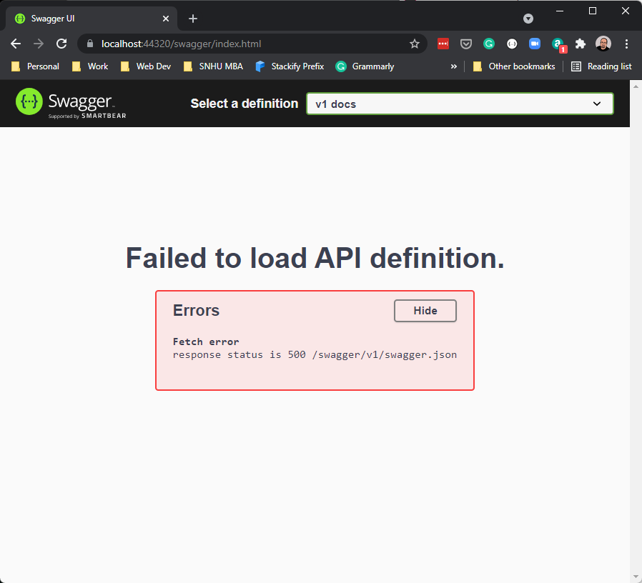

# Documenting your API with OpenAPI

## START FROM PREVIOUS MODULE'S END
[Versioning your Web API](versioning.md)

## DECORATE EVERY VERSION 1.0 CONTROLLER WITH VERSIONING

```csharp
[Route( "api/v{version:apiVersion}/[controller]" )]
[ApiController]
[EnableCors("CorsPolicy")]
[ApiVersion( "1.0" )]
public class CustomerController : ControllerBase
``` 

## DECORATE EVERY VERSION 1.0 CONTROLLER ACTION WITH VERSIONING

```csharp
[HttpGet]
[Produces(typeof(List<AlbumApiModel>))]
[MapToApiVersion("1.0")]
public async Task<ActionResult<List<AlbumApiModel>>> Get()
```

## ADD OPENAPI/SWAGGER NUGET PACKAGES TO API PROJECT

```dos
dotnet add package Swashbuckle.AspNetCore.Swagger
dotnet add package Swashbuckle.AspNetCore.SwaggerGen
dotnet add package Swashbuckle.AspNetCore.SwaggerUI
dotnet add package Swashbuckle.AspNetCore.Annotations
```

## ADD OPENAPI/SWAGGER TO STARTUP CONFIGURESERVICES

### ServicesConfiguration.cs

```csharp
public static void AddSwaggerServices(this IServiceCollection services)
{
    services.AddSwaggerGen(c =>
    {
        c.SwaggerDoc("v1", new OpenApiInfo
        {
            Version = "v1",
            Title = "Chinook Music Store API",
            Description = "A simple example ASP.NET Core Web API",
            TermsOfService = new Uri("https://example.com/terms"),
            Contact = new OpenApiContact
            {
                Name = "Chris Woodruff",
                Email = string.Empty,
                Url = new Uri("https://chriswoodruff.com")
            },
            License = new OpenApiLicense
            {
                Name = "Use under MIT",
                Url = new Uri("https://opensource.org/licenses/MIT")
            }
        });
        c.EnableAnnotations();
    });
}
```

## ADD OPENAPI/SWAGGER TO STARTUP 

```csharp
builder.Services.AddSwaggerServices();

app.UseSwagger();
app.UseSwaggerUI(s => s.SwaggerEndpoint("/swagger/v1/swagger.json", "v1 docs"));
```

## DISCOVER THAT OUR SWAGGER SETUP DOES NOT WORK WITH OUR VERSIONING


<span style='color: red;font-size: large;'>**We will now resolve and allow the Web API solution to use version for OpenAPI**</span>

## ADD APIEXPLORER

### ADD APIEXPLORER NUGET PACKAGES TO API PROJECT
```dos
dotnet add package Microsoft.AspNetCore.Mvc.Versioning.ApiExplorer
```

### ADD ADDAPIEXPLORER METHOD TO CONFIGURESERVICES

```csharp
public static void AddApiExplorer(this IServiceCollection services)
{
    services.AddVersionedApiExplorer(setup =>
    {
        setup.GroupNameFormat = "'v'VVV";
        setup.SubstituteApiVersionInUrl = true;
    });
}
```

## REMOVE PREVIOUS ADDSWAGGERSERVICES IN CONFIGURESERVICES.CS

Remove the following code:
```csharp
public static void AddSwaggerServices(this IServiceCollection services)
{
    services.AddSwaggerGen(c =>
    {
        c.SwaggerDoc("v1", new OpenApiInfo
        {
            Version = "v1",
            Title = "Chinook Music Store API",
            Description = "A simple example ASP.NET Core Web API",
            TermsOfService = new Uri("https://example.com/terms"),
            Contact = new OpenApiContact
            {
                Name = "Chris Woodruff",
                Email = string.Empty,
                Url = new Uri("https://chriswoodruff.com")
            },
            License = new OpenApiLicense
            {
                Name = "Use under MIT",
                Url = new Uri("https://opensource.org/licenses/MIT")
            }
        });
        c.EnableAnnotations();
    });
}
```

## ADD OPENAPI/SWAGGER TO CONFIGURESERVICES.CS

``` csharp
public static void AddSwaggerServices(this IServiceCollection services)
{
    services.AddSwaggerGen(options => {
        // for further customization
        //options.OperationFilter<DefaultValuesFilter>();
    });
    services.AddSwaggerGen();
    services.ConfigureOptions<ConfigureSwaggerOptions>();
}
```

## ADD CONFIGURESWAGGEROPTIONS CLASS TO CONFIGURESERVICES.CS

``` csharp
public class ConfigureSwaggerOptions : IConfigureNamedOptions<SwaggerGenOptions>
{
    private readonly IApiVersionDescriptionProvider provider;

    public ConfigureSwaggerOptions(IApiVersionDescriptionProvider provider)
    {
        this.provider = provider;
    }

    public void Configure(SwaggerGenOptions options)
    {
        // add swagger document for every API version discovered
        foreach (var description in provider.ApiVersionDescriptions)
        {
            options.SwaggerDoc(
                description.GroupName,
                CreateVersionInfo(description));
            options.EnableAnnotations();
        }
    }

    public void Configure(string name, SwaggerGenOptions options)
    {
        Configure(options);
    }

    private OpenApiInfo CreateVersionInfo(ApiVersionDescription description)
    {
        var info = new OpenApiInfo()
        {
            Title = "Chinook Music Store API",
            Version = description.ApiVersion.ToString(),
            Description = "A simple example ASP.NET Core Web API",
            TermsOfService = new Uri("https://example.com/terms"),
            Contact = new OpenApiContact
            {
                Name = "Chris Woodruff",
                Email = string.Empty,
                Url = new Uri("https://woodruff.dev")
            },
            License = new OpenApiLicense
            {
                Name = "Use under MIT",
                Url = new Uri("https://opensource.org/licenses/MIT")
            }
        };

        if (description.IsDeprecated)
        {
            info.Description += " This API version has been deprecated.";
        }

        return info;
    }
}
```

## ADD APPBUILDEREXTENSIONS.CS TO API PROJECT


### CREATE APPBUILDEREXTENSIONS CLASS AND USESWAGGERWITHVERSIONING METHOD

``` csharp
public static class AppBuilderExtensions
{
    public static IApplicationBuilder UseSwaggerWithVersioning(this IApplicationBuilder app)
    {
        IServiceProvider services = app.ApplicationServices;
        var provider = services.GetRequiredService<IApiVersionDescriptionProvider>();

        app.UseSwagger();

        app.UseSwaggerUI(options =>
        {
            foreach (var description in provider.ApiVersionDescriptions)
            {
                options.SwaggerEndpoint($"/swagger/{description.GroupName}/swagger.json", description.GroupName.ToUpperInvariant());
            }
        });

        return app;
    }
}
```

## CONNECTION EVERYTHING INSIDE PROGRAM.CS

``` csharp
builder.Services.AddApiExplorer();
builder.Services.AddSwaggerServices();


app.UseSwaggerWithVersioning();
```
