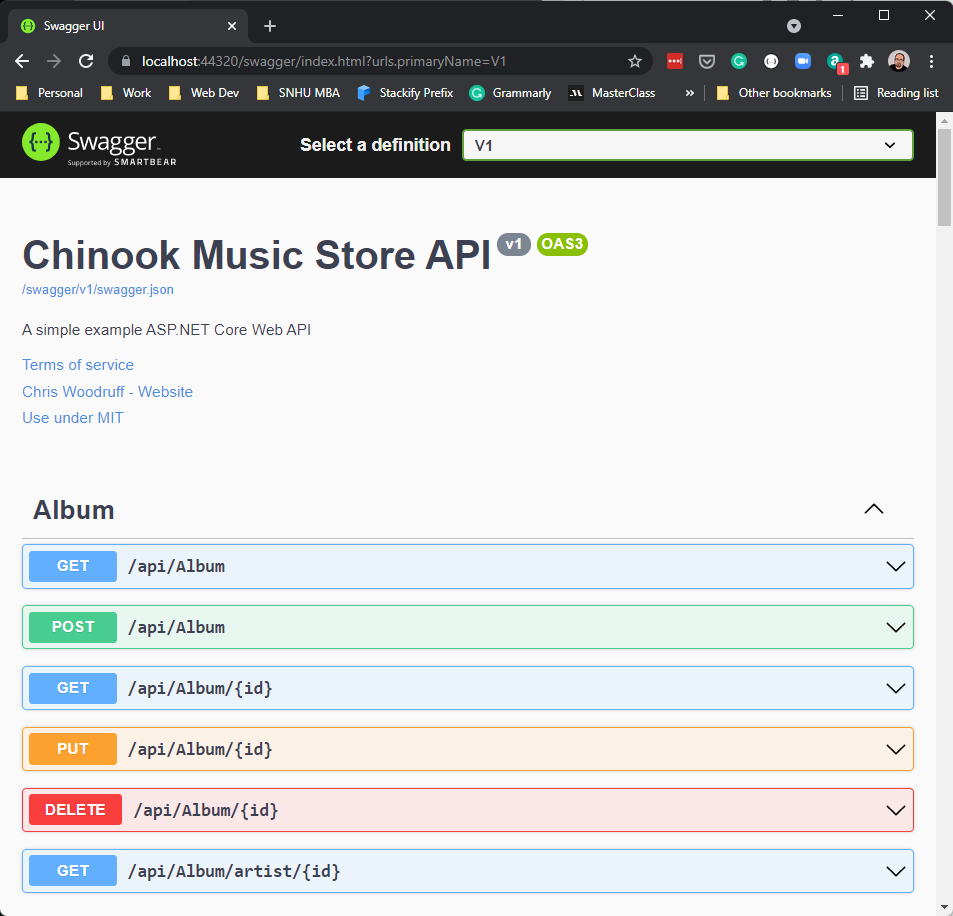
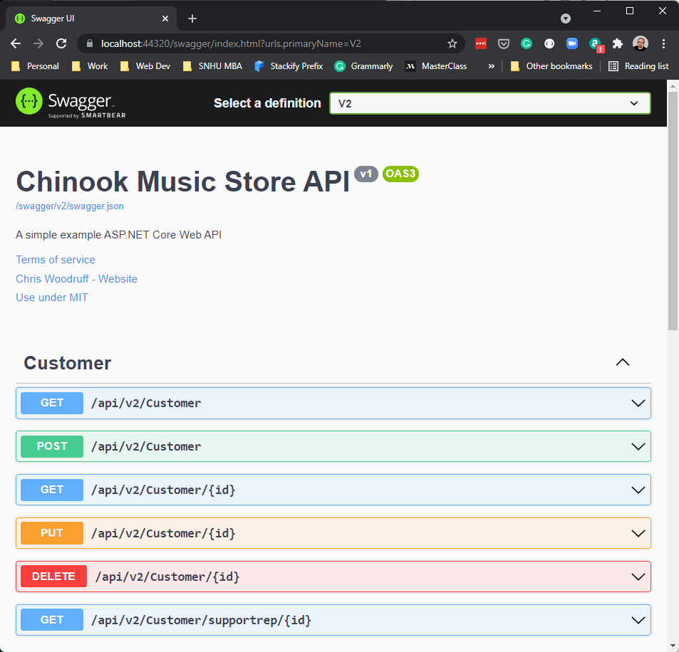

# Documenting your API with OpenAPI

## START FROM PREVIOUS MODULE'S END
[Versioning your Web API](versioning.md)

## ADD OPENAPI/SWAGGER NUGET PACKAGES TO API PROJECT

```dos
dotnet add package Swashbuckle.AspNetCore.Swagger
dotnet add package Swashbuckle.AspNetCore.SwaggerGen
dotnet add package Swashbuckle.AspNetCore.SwaggerUI
dotnet add package Swashbuckle.AspNetCore.Annotations
```

## ADD OPENAPI/SWAGGER TO STARTUP CONFIGURESERVICES

### ServicesConfiguration.cs

```csharp
public static void AddSwaggerServices(this IServiceCollection services)
{
    services.AddSwaggerGen(c =>
    {
        c.SwaggerDoc("v1", new OpenApiInfo
        {
            Version = "v1",
            Title = "Chinook Music Store API",
            Description = "A simple example ASP.NET Core Web API",
            TermsOfService = new Uri("https://example.com/terms"),
            Contact = new OpenApiContact
            {
                Name = "Chris Woodruff",
                Email = string.Empty,
                Url = new Uri("https://chriswoodruff.com")
            },
            License = new OpenApiLicense
            {
                Name = "Use under MIT",
                Url = new Uri("https://opensource.org/licenses/MIT")
            }
        });
        c.EnableAnnotations();
    });
}
```

## ADD OPENAPI/SWAGGER TO STARTUP 

```csharp
builder.Services.AddSwaggerServices();

app.UseSwagger();
app.UseSwaggerUI(s => s.SwaggerEndpoint("/swagger/v1/swagger.json", "v1 docs"));
```

## DISCOVER THAT OUR SWAGGER SETUP DOES NOT WORK WITH OUR VERSIONING


## DECORATE EVERY VERSION 2.0 CONTROLLER ACTION ENDPOINT WITH VERSIONING

```csharp
[Route( "api/v{version:apiVersion}/[controller]" )]
[ApiController]
[EnableCors("CorsPolicy")]
[ApiVersion( "2.0" )]
public class CustomerController : ControllerBase
```

## INSTALL APIEXPLORER NUGET PACKAGE IN API PROJECT

```dos
dotnet add package Microsoft.AspNetCore.Mvc.Versioning.ApiExplorer
```

## ADD APIEXPLORER TO SERVICES IN STARTUP

### ServicesConfiguration.cs

```csharp
public static void AddApiExplorer(this IServiceCollection services)
{
    services.AddVersionedApiExplorer(setup =>
    {
        setup.GroupNameFormat = "'v'VVV";
        setup.SubstituteApiVersionInUrl = true;
    });
}
```

## ADD ConfigureSwaggerOptions AND MODIFY THE SWAGGER CODE TO DOCUMENT EACH VERSION'S SWAGGER FILE

### ServicesConfiguration.cs

```csharp
public static void AddSwaggerServices(this IServiceCollection services)
{

    services.AddSwaggerGen();
    services.ConfigureOptions<ConfigureSwaggerOptions>();
}

public static void AddApiExplorer(this IServiceCollection services)
{
    services.AddVersionedApiExplorer(setup =>
    {
        setup.GroupNameFormat = "'v'VVV";
        setup.SubstituteApiVersionInUrl = true;
    });
}
```

### Add ConfigureSwaggerOptions class to ServicesConfiguration.cs

```csharp
public class ConfigureSwaggerOptions : IConfigureNamedOptions<SwaggerGenOptions>
{
    private readonly IApiVersionDescriptionProvider provider;

    public ConfigureSwaggerOptions(IApiVersionDescriptionProvider provider)
    {
        this.provider = provider;
    }

    public void Configure(SwaggerGenOptions options)
    {
        // add swagger document for every API version discovered
        foreach (var description in provider.ApiVersionDescriptions)
        {
            options.SwaggerDoc(
                description.GroupName,
                CreateVersionInfo(description));
            options.EnableAnnotations();
        }
    }

    public void Configure(string name, SwaggerGenOptions options)
    {
        Configure(options);
    }

    private OpenApiInfo CreateVersionInfo(ApiVersionDescription description)
    {
        var info = new OpenApiInfo()
        {
            Version = "v1",
            Title = "Chinook Music Store API",
            Description = "A simple example ASP.NET Core Web API",
            TermsOfService = new Uri("https://example.com/terms"),
            Contact = new OpenApiContact
            {
                Name = "Chris Woodruff",
                Email = string.Empty,
                Url = new Uri("https://chriswoodruff.com")
            },
            License = new OpenApiLicense
            {
                Name = "Use under MIT",
                Url = new Uri("https://opensource.org/licenses/MIT")
            }
        };

        if (description.IsDeprecated)
        {
            info.Description += " This API version has been deprecated.";
        }

        return info;
    }
}
```

## ADD APIEXPLORER TO STARTUP 

```csharp
builder.Services.AddApiExplorer();
builder.Services.AddSwaggerServices();

app.UseSwagger();
app.UseSwaggerUI(s => s.SwaggerEndpoint("/swagger/v1/swagger.json", "v1 docs"));
```

## CHANGE launchSettings.json IN PROPERTIES FOLDER TO LAUNCH SWAGGER ON RUN

```json
"profiles": {
    "Chinook.API": {
      "commandName": "Project",
      "dotnetRunMessages": true,
      "launchBrowser": true,
      "launchUrl": "swagger/",
      "applicationUrl": "https://localhost:7211;http://localhost:5211",
      "environmentVariables": {
        "ASPNETCORE_ENVIRONMENT": "Development"
      }
    },
    "IIS Express": {
      "commandName": "IISExpress",
      "launchBrowser": true,
      "launchUrl": "swagger/",
      "environmentVariables": {
        "ASPNETCORE_ENVIRONMENT": "Development"
      }
    }
}
```

## SWAGGER FOR V1


## SWAGGER FOR V2


**NOTE:** Solution for versioning issues from @referbruv https://www.referbruv.com/blog/posts/integrating-aspnet-core-api-versions-with-swagger-ui


