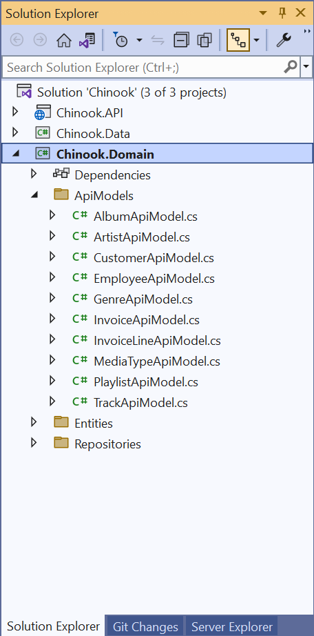
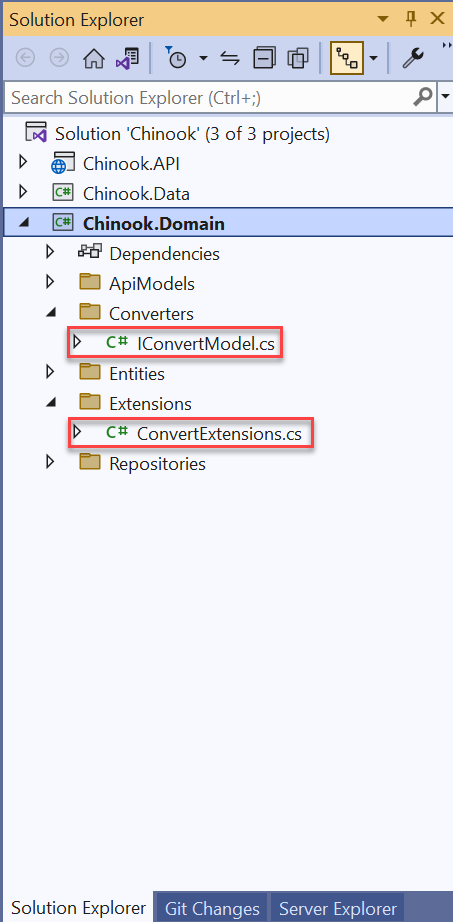
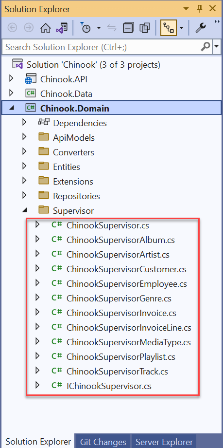
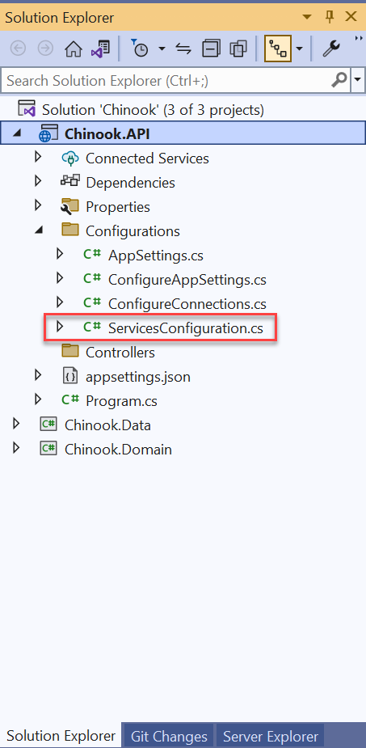
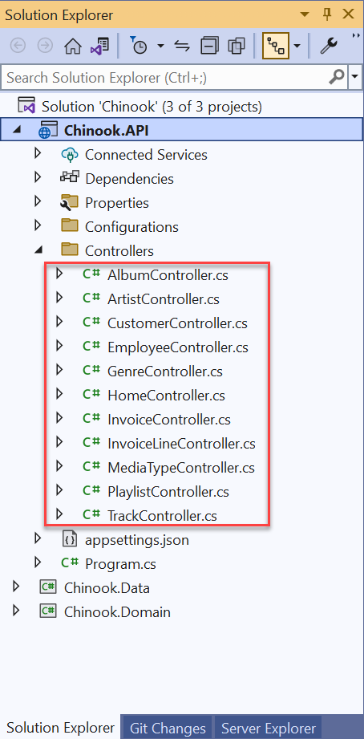

# Developing the API endpoints

## START FROM PREVIOUS MODULE'S END
[Developing the API Data access](ntier-data-access.md)

## ADD APIMODELS TO DOMAIN



```csharp
namespace ChinookASPNETWebAPI.Domain.ApiModels;

public class AlbumApiModel
{
    public int Id { get; set; }
    public string Title { get; set; }
    public int ArtistId { get; set; }
    public string ArtistName { get; set; }

    public ArtistApiModel Artist { get; set; }

    public IList<TrackApiModel> Tracks { get; set; }
}
```


## ADD IConvertModel TO DOMAIN



```csharp
namespace Chinook.Domain.Converters;

public interface IConvertModel<out TTarget>
{
    TTarget Convert();
}
```


## ADD ConvertExtensions TO DOMAIN

```csharp
using Chinook.Domain.Converters;

namespace Chinook.Domain.Extensions;

public static class ConvertExtensions
{
    public static IEnumerable<TTarget> ConvertAll<TTarget>(
        this IEnumerable<IConvertModel<TTarget>> values)
        => values.Select(value => value.Convert());
}
```

## ADD CONVERT CODE APIMODELS IN DOMAIN

```csharp
using Chinook.Domain.Converters;
using Chinook.Domain.Entities;

namespace ChinookASPNETWebAPI.Domain.ApiModels;

public class AlbumApiModel : IConvertModel<Album>
{
    public int Id { get; set; }
    public string Title { get; set; }
    public int ArtistId { get; set; }
    public string ArtistName { get; set; }

    public ArtistApiModel Artist { get; set; }

    public IList<TrackApiModel> Tracks { get; set; }

    public Album Convert() =>
        new()
        {
            Id = Id,
            ArtistId = ArtistId,
            Title = Title ?? string.Empty
        };
}
```


## ADD CONVERT CODE ENTITIES IN DOMAIN

```csharp
using Chinook.Domain.Converters;
using ChinookASPNETWebAPI.Domain.ApiModels;

namespace Chinook.Domain.Entities;

public partial class Album : IConvertModel<AlbumApiModel>
{
    public Album()
    {
        Tracks = new HashSet<Track>();
    }

    public int Id { get; set; }
    public string Title { get; set; } = null!;
    public int ArtistId { get; set; }

    public virtual Artist Artist { get; set; } = null!;
    public virtual ICollection<Track> Tracks { get; set; }

    public AlbumApiModel Convert() =>
        new()
        {
            Id = Id,
            ArtistId = ArtistId,
            Title = Title
        };
}
```

## ADD SUPERVISOR TO DOMAIN



Take a look at the <a href="https://github.com/cwoodruff/aspnet-6-web-api-workshop/tree/main/module-1/01-06%20Developing%20the%20API%20Endpoints/end/Chinook.Domain/Supervisor" target="_blank">code here</a> for the logic of the Supervisor

## ADD APPSETTINGS TO  API PROJECT 



## ADD SERVICESCONFIGURATION TO API PROJECT

```csharp
using Chinook.Domain.Repositories;
using Chinook.Domain.Supervisor;
using Chinook.Data.Repositories;

namespace Chinook.API.Configurations;

public static class ServicesConfiguration
{
    public static void ConfigureRepositories(this IServiceCollection services)
    {
        services.AddScoped<IAlbumRepository, AlbumRepository>()
            .AddScoped<IArtistRepository, ArtistRepository>()
            .AddScoped<ICustomerRepository, CustomerRepository>()
            .AddScoped<IEmployeeRepository, EmployeeRepository>()
            .AddScoped<IGenreRepository, GenreRepository>()
            .AddScoped<IInvoiceRepository, InvoiceRepository>()
            .AddScoped<IInvoiceLineRepository, InvoiceLineRepository>()
            .AddScoped<IMediaTypeRepository, MediaTypeRepository>()
            .AddScoped<IPlaylistRepository, PlaylistRepository>()
            .AddScoped<ITrackRepository, TrackRepository>();
    }

    public static void ConfigureSupervisor(this IServiceCollection services)
    {
        services.AddScoped<IChinookSupervisor, ChinookSupervisor>();
    }
}
```

## ADD ConfigureRepositories() AND ConfigureSupervisor() TO CONFIGURESERVICES IN API PROJECT

```csharp
builder.Services.ConfigureRepositories();
builder.Services.ConfigureSupervisor();
```


## ADD CONTROLLERS TO API 



## ADD ACTIONS TO CONTROLLERS

```csharp
using System.Net;
using Chinook.Domain.ApiModels;
using Chinook.Domain.Supervisor;
using Microsoft.AspNetCore.Mvc;

namespace Chinook.API.Controllers;

//[Authorize]
[Route("api/[controller]")]
[ApiController]
public class AlbumController : ControllerBase
{
    private readonly IChinookSupervisor _chinookSupervisor;
    private readonly ILogger<AlbumController> _logger;

    public AlbumController(IChinookSupervisor chinookSupervisor, ILogger<AlbumController> logger)
    {
        _chinookSupervisor = chinookSupervisor;
        _logger = logger;
    }

    [HttpGet]
    [Produces(typeof(List<AlbumApiModel>))]
    public async Task<ActionResult<List<AlbumApiModel>>> Get()
    {
        var albums = await _chinookSupervisor.GetAllAlbum();

        if (albums.Any())
        {
            return Ok(albums);
        }
        else
        {
            return StatusCode((int)HttpStatusCode.NotFound, "No Albums Could Be Found");
        }
    }

    [HttpGet("{id}", Name = "GetAlbumById")]
    public async Task<ActionResult<AlbumApiModel>> Get(int id)
    {
        var album = await _chinookSupervisor.GetAlbumById(id);

        if (album != null)
        {
            return Ok(album);
        }
        else
        {
            return StatusCode((int)HttpStatusCode.NotFound, "Album Not Found");
        }
    }

    [HttpPost]
    [Produces("application/json")]
    [Consumes("application/json")]
    public async Task<ActionResult<AlbumApiModel>> Post([FromBody] AlbumApiModel input)
    {
        if (input == null)
        {
            return StatusCode((int)HttpStatusCode.BadRequest, "Given Album is null");
        }
        else
        {
            return Ok(await _chinookSupervisor.AddAlbum(input));
        }
    }

    [HttpPut("{id}")]
    [Produces("application/json")]
    [Consumes("application/json")]
    public async Task<ActionResult<AlbumApiModel>> Put(int id, [FromBody] AlbumApiModel input)
    {
        if (input == null)
        {
            return StatusCode((int)HttpStatusCode.BadRequest, "Given Album is null");
        }
        else
        {
            return Ok(await _chinookSupervisor.UpdateAlbum(input));
        }
    }

    [HttpDelete("{id}")]
    public async Task<ActionResult> Delete(int id)
    {
        return Ok(await _chinookSupervisor.DeleteAlbum(id));
    }

    [HttpGet("artist/{id}")]
    public async Task<ActionResult<List<AlbumApiModel>>> GetByArtistId(int id)
    {
        var albums = await _chinookSupervisor.GetAlbumByArtistId(id);

        if (albums.Any())
        {
            return Ok(albums);
        }
        else
        {
            return StatusCode((int)HttpStatusCode.NotFound, "No Albums Could Be Found for the Artist");
        }
    }
}
```

## ADD LOGGING TO API PROJECT Add Logging to API Project ServicesConfiguration class

```csharp
public static void AddAPILogging(this IServiceCollection services)
{
    services.AddLogging(builder => builder
        .AddConsole()
        .AddFilter(level => level >= LogLevel.Information)
    );
    
    services.AddHttpLogging(logging =>
    {
        // Customize HTTP logging.
        logging.LoggingFields = HttpLoggingFields.All;
        logging.RequestHeaders.Add("My-Request-Header");
        logging.ResponseHeaders.Add("My-Response-Header");
        logging.MediaTypeOptions.AddText("application/javascript");
        logging.RequestBodyLogLimit = 4096;
        logging.ResponseBodyLogLimit = 4096;
    });
}
```

## ADD AddAPILogging TO PROGRAM IN API PROJECT

```csharp
builder.Services.AddAPILogging();
```

## CHANGE LAUNCHSETTINGS

```json
{
  "$schema": "https://json.schemastore.org/launchsettings.json",
  "iisSettings": {
    "windowsAuthentication": false,
    "anonymousAuthentication": true,
    "iisExpress": {
      "applicationUrl": "http://localhost:46460",
      "sslPort": 44369
    }
  },
  "profiles": {
    "Chinook.API": {
      "commandName": "Project",
      "dotnetRunMessages": true,
      "launchBrowser": true,
      "launchUrl": "api/",
      "applicationUrl": "https://localhost:7211;http://localhost:5211",
      "environmentVariables": {
        "ASPNETCORE_ENVIRONMENT": "Development"
      }
    },
    "IIS Express": {
      "commandName": "IISExpress",
      "launchBrowser": true,
      "launchUrl": "api/",
      "environmentVariables": {
        "ASPNETCORE_ENVIRONMENT": "Development"
      }
    }
  }
}
```

