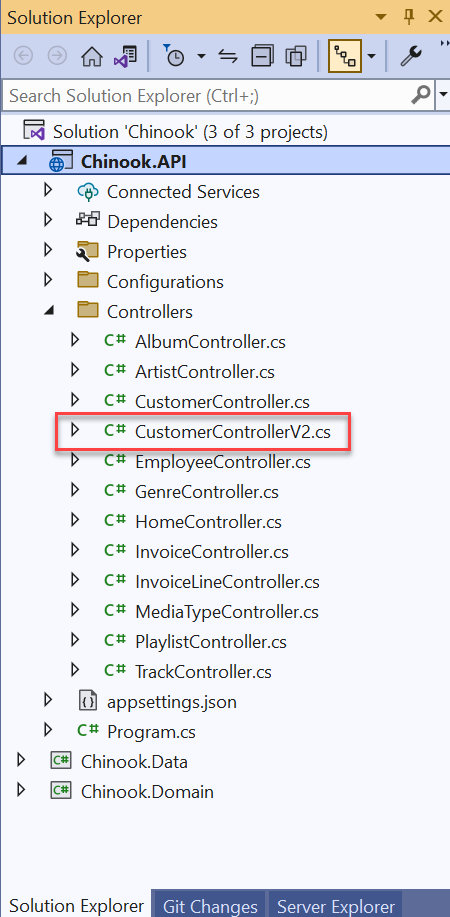
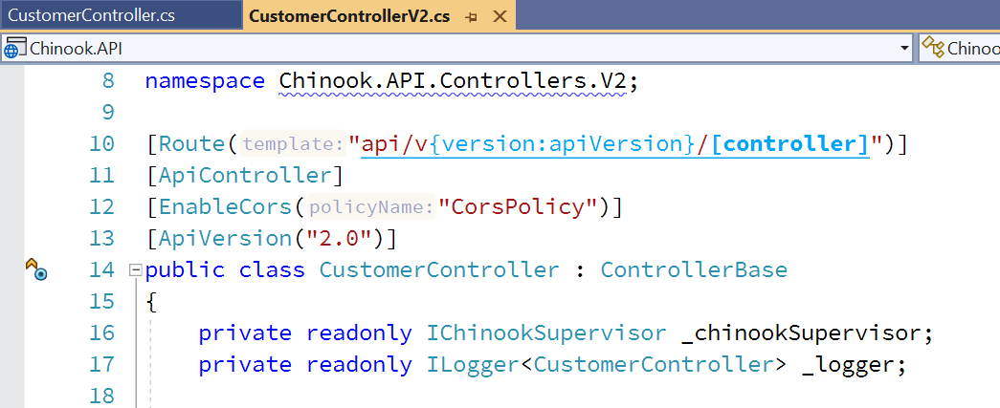
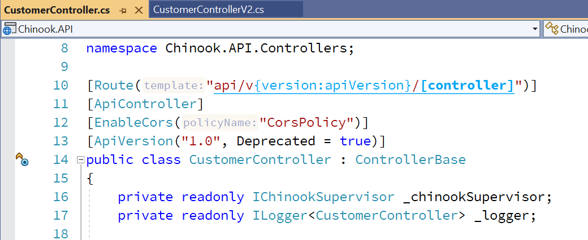
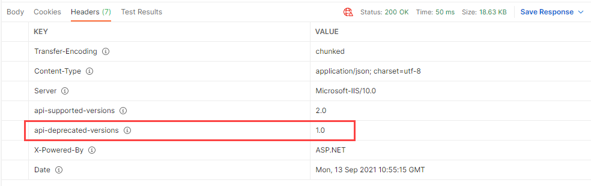

# Versioning your Web API

## START FROM PREVIOUS MODULE'S END
[Caching Data in Your API](caching-data.md)

## ADD VERSIONING NUGET PACKAGE TO API PROJECT

```dos
dotnet add package Microsoft.AspNetCore.Mvc.Versioning
```

## ADD VERSIONING TO ServicesConfiguration IN API PROJECT

### ServicesConfiguration.cs

```csharp
public static void AddVersioning(this IServiceCollection services)
{
    services.AddApiVersioning(options =>
    {
        options.AssumeDefaultVersionWhenUnspecified = true;
        options.DefaultApiVersion = new ApiVersion(1, 0);
        //options.DefaultApiVersion = new ApiVersion( new DateTime( 2023, 8, 4 ) );
        //options.DefaultApiVersion = new ApiVersion(new DateTime( 2023, 8, 4 ), "LetoII", 1, "Beta");
        options.ReportApiVersions = true;
    });
}
```

## ADD API VERSIONING TO STARTUP IN API PROJECT

```csharp
builder.Services.AddVersioning();
```

## ADD NEW CUSTOMER CONTROLLER FOR VERSION 2

```csharp
[Route("api/v{version:apiVersion}/[controller]")]
[ApiController]
[EnableCors("CorsPolicy")]
[ApiVersion("2.0")]
public class CustomerController : ControllerBase
```


## MODIFY CUSTOMER V1 CONTROLLER FOR VERSIONING IN API PROJECT

```csharp
[Route( "api/v{version:apiVersion}/[controller]" )]
[ApiController]
[EnableCors("CorsPolicy")]
[ApiVersion( "1.0", Deprecated = true)]
public class CustomerController : ControllerBase
```


## TEST IN POSTMAN

### Version 1 Endpoint
```dos
https://localhost:44320/api/v1/Customer
```



### Version 2 Endpoint
```dos
https://localhost:44320/api/v2/Customer
```


