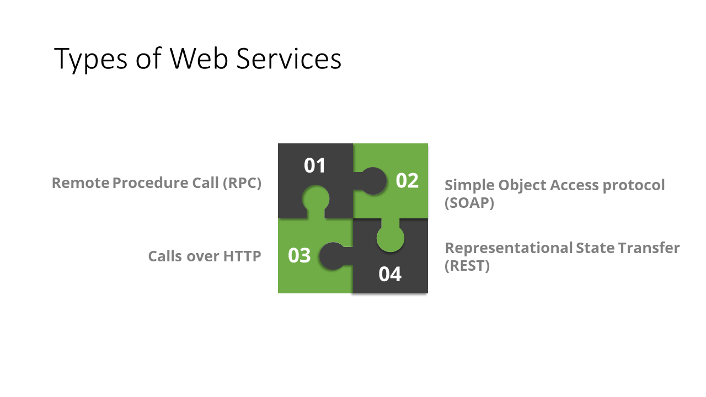
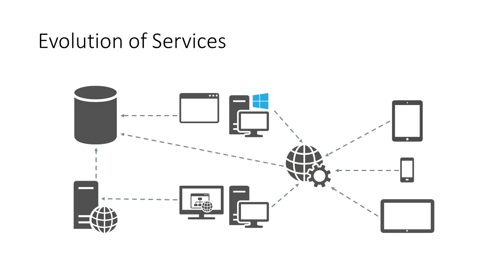

# What is an API?

In computer programming, an application programming interface (API) is a set of subroutine definitions, protocols, and tools for building software and applications.

# So what is a Web API?

* Ideal for building RESTful services
* Supports HTTP
* Uses HTTP Requests and Responses
* Maps to HTTP verbs

