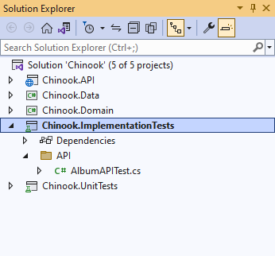
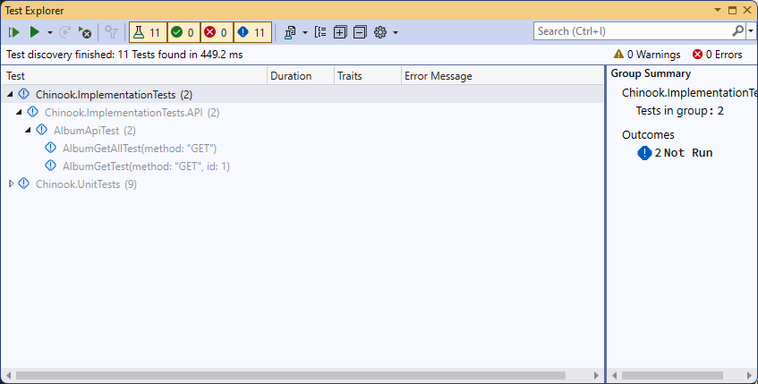
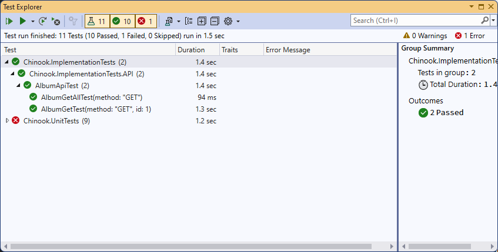

# Creating and using Integration Testing for your API

## OPEN SOLUTION (BEFORE PAGING MODULE) IN THE TESTING MODULE FOR INTEGRATION TESTING

[Creating and using Unit Testing for your API](unit-testing.md)

## EXPLORER THE ChinookASPNETWebAPI.IntegrationTest PROJECT AND UNDERSTAND THE TESTS

This will give you a good insight into how to create implementation tests for different components of your Web API




## MODIFY THE PROGRAM FILE IN API PROJECT

If you get an error that testhost.deps.json is missing then add the following to your API project's Program.cs
```csharp
public partial class Program { }
```

## ADD THE SET UP FOR THE IMPLEMENTATION TESTS IN ADDITIONAL TEST CLASSES

``` csharp
private readonly HttpClient _client;

public AlbumApiTest()
{
    var application = new WebApplicationFactory<Program>()
        .WithWebHostBuilder(builder =>
        {
            // ... Configure test services
        });

    _client = application.CreateClient();
}
```

## CREATE ADDITIONAL INTEGRATION TESTS

Using the existing integration tests for the Album as a guide, build more integration tests for some of the other models in the solution.

```csharp
[Theory]
[InlineData("GET")]
public async void AlbumGetAllTest(string method)
{
    // Arrange
    var request = new HttpRequestMessage(new HttpMethod(method), "/api/v1.0/Album/");

    // Act
    var response = await _client.SendAsync(request);

    // Assert
    response.EnsureSuccessStatusCode();
    Assert.Equal(HttpStatusCode.OK, response.StatusCode);
}

[Theory]
[InlineData("GET", 1)]
public async Task AlbumGetTest(string method, int? id = null)
{
    // Arrange
    var request = new HttpRequestMessage(new HttpMethod(method), $"/api/Album/{id}");

    // Act
    var response = await _client.SendAsync(request);

    // Assert
    response.EnsureSuccessStatusCode();
    Assert.Equal(HttpStatusCode.OK, response.StatusCode);
}
```
<span style='color: red;font-size: large;'>**Please understand you will only need one of the Asserts from the previous tests. I have given you two ways to test and find the results**</span>

## OPEN TEST EXPLORER AND BUILD TO SEE TESTS IN YOUR SOLUTION
<span style='color: red;font-size: large;'>**Note -- You may need to rebuild your project for the Test Explorer to find the tests**</span>



## RUN TESTS

