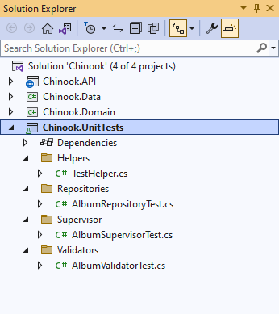
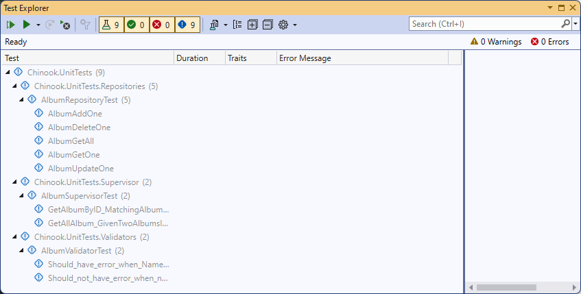
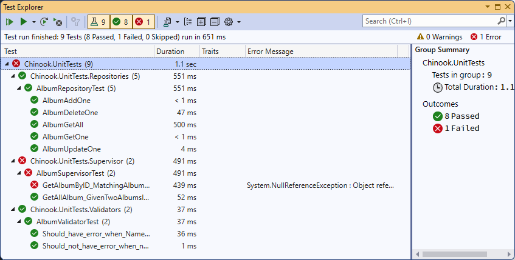

# Creating and using Unit Testing for your API

## START FROM THE DOCUMENTING YOUR API WITH OPENAPI (MODULE 1) MODULE'S END

[Documenting your API with OpenAPI](../Standing%20Up%20an%20ASP.NET%20Core%20Web%20API/designing-ntier-api.md)

## EXPLORER THE ChinookASPNETWebAPI.UnitTest PROJECT AND UNDERSTAND THE TESTS

This will give you a good insight into how to create unit tests for different components of your Web API



## REVIEW AND UNDERSTAND THE TESTHELPER CODE

<span style='color: red;font-size: large;'>**Please understand the code for the TestHelp in the /Helper folder in the project.**</span>

## CREATE ADDITIONAL UNIT TESTS FOR DATA REPOSITORIES

Using the existing tests for the Album and Artist Data Repositories as a guide, build unit tests for some of the other models in the solution.

```csharp
[Fact]
public async Task AlbumGetAll()
{
    var artist = new Artist() { Id = 1, Name = "Artist1" };
    var album1 = new Album { Id = 12, Title = "Title1", ArtistId = 1};
    var album2 = new Album { Id = 123, Title = "Title1", ArtistId = 1};

    // Arrange
    _context.Artists.Add(artist);
    _context.Albums.Add(album1);
    _context.Albums.Add(album2);
    _context.SaveChanges();

    // Act
    var albums = await _repo.GetAll();

    // Assert
    albums.Count.Should().Be(2);
    albums.Should().Contain(x => x.Id == 12);
    albums.Should().Contain(x => x.Id == 123);
}

[Fact]
public async Task AlbumGetOne()
{
    // Arrange
    var albumId = 1;
    var artistId = 1;

    // We are currently required to care about an Artist ID because the convert part of album specifically references the artist repository as well.
    _context.Artists.Add(new Artist() { Id = artistId, Name = "Artist"});
    _context.Albums.Add(new Album() { Id = albumId, Title = "Title", ArtistId = artistId });
    _context.SaveChanges();

    // Act
    var album = await _repo.GetById(albumId);

    // Assert
    album.Id.Should().Be(albumId);
}
```


## CREATE ADDITIONAL UNIT TESTS FOR SUPERVISOR

Using the existing tests for the Album and Artist Supervisor as a guide, build unit tests for some of the other models in the solution.

```csharp
[Fact]
public async Task GetAllAlbum_GivenTwoAlbumsInTheDatabase_ReturnsBoth()
{
    var album1 = new Album { Id = 12 };
    var album2 = new Album { Id = 123 };

    // Arrange
    _context.Albums.Add(album1);
    _context.Albums.Add(album2);
    _context.SaveChanges();

    // Act
    var albums = (await _super.GetAllAlbum()).ToList();

    // Assert
    albums.Count.Should().Be(2);
    albums.Should().Contain(x => x.Id == 12);
    albums.Should().Contain(x => x.Id == 123);
}

[Fact]
public void GetAlbumByID_MatchingAlbumInDB_ReturnsIt()
{
    // Arrange
    var albumId = 1;
    var artistId = 1234;

    // We are currently required to care about an Artist ID because the convert part of album specifically references the artist repository as well.
    _context.Artists.Add(new Artist() { Id = artistId });
    _context.Albums.Add(new Album() { Id = 1, ArtistId = 1234 });
    _context.SaveChanges();

    // Act
    var album = _super.GetAlbumById(albumId);

    // Assert
    album.Id.Should().Be(1);
}
```

<span style='color: red;font-size: large;'>**There are other tests in the demos for your knowledge**</span>

## CREATE ADDITIONAL UNIT TESTS FOR VALIDATORS

Using the existing tests for the Album Validator as a guide, build unit tests for some of the other models in the solution.

```csharp
[Fact]
public void Should_have_error_when_Name_is_null()
{
    // Arrange
    var model = new AlbumApiModel { Title = null };

    // Act
    var result = _validator.TestValidate(model);

    // Assert
    result.ShouldHaveValidationErrorFor(album => album.Title);
}

[Fact]
public void Should_not_have_error_when_name_is_specified()
{
    // Arrange
    var model = new AlbumApiModel { Title = "Abbey Road" };

    // Act
    var result = _validator.TestValidate(model);

    // Assert
    result.ShouldNotHaveValidationErrorFor(album => album.Title);
}
```


## OPEN TEST EXPLORER AND BUILD TO SEE TESTS IN YOUR SOLUTION

<span style='color: red;font-size: large;'>**Note -- You may need to rebuild your project for the Test Explorer to find the tests**</span>



## RUN TESTS


